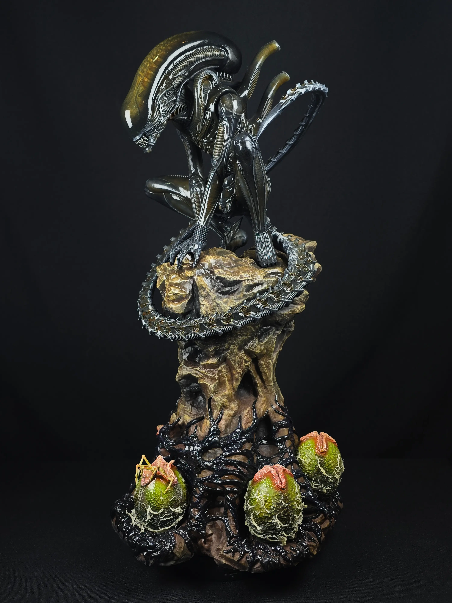

# Case Study — Threedii Paint Studio

> Web storefront for a studio that 3D-prints and hand-paints collectible figures.
> **Live:** https://threedii.com

| | |
|---|---|
| **Role** | Solo front-end developer (freelance) |
| **Client** | Threedii — hand-painted 3D-printed collectible figures · Colombia |
| **Stack** | React 19 · Vite 8 · React Router · Playwright · Lighthouse CI · Vercel |
| **Status** | In production |

---

## Problem
Threedii needed a fast, striking storefront to present its catalog of hand-painted figures (from games, films, comics and anime) and turn interest into orders — with strong performance and SEO.

## What I built
- **Filterable catalog** — a bento-grid gallery with multi-category tags, hover image cycling and a per-figure detail view.
- **Quote flow ("Cotizar")** — selecting a figure prefills a request and opens a pre-written WhatsApp message, turning browsing into leads.
- **Performance-first build** — build-time responsive images (`sharp`, 400/800/1200w `srcset`), scroll-reveal animations and a desktop custom cursor.
- **SEO ready** — structured data, Open Graph / Twitter cards, an auto-generated sitemap and a `<noscript>` fallback.

## Results
- Production site on Vercel, with CI (lint/build, security checks and Lighthouse budgets) gating every change.
- Polished, responsive UX with reduced-motion support.

## Gallery

---

Code is proprietary to Threedii — this repository documents my work for portfolio purposes. Built by <a href="https://github.com/johnvergel-dev">John Vergel</a>.