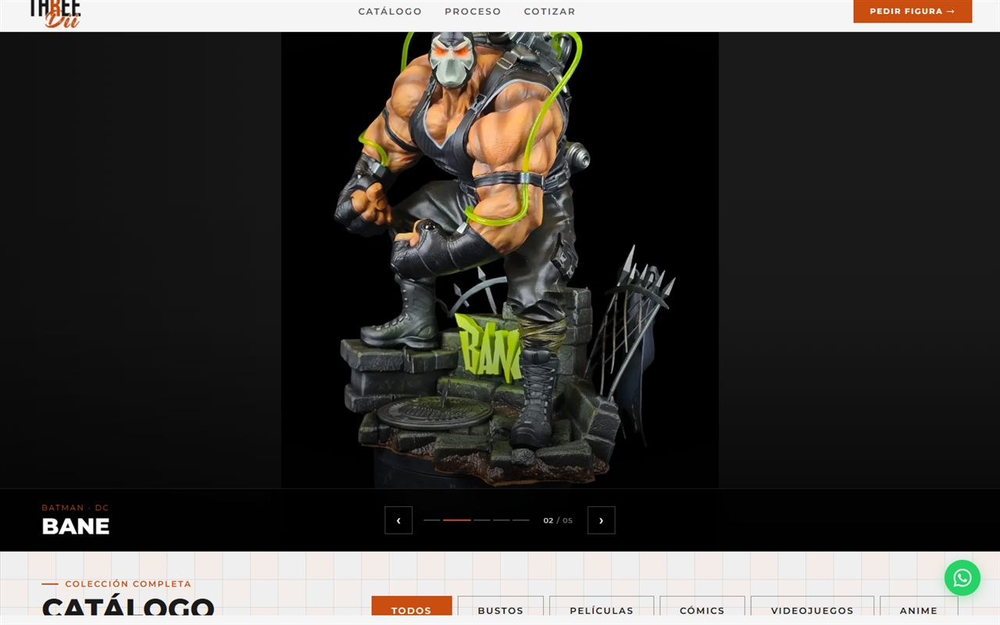
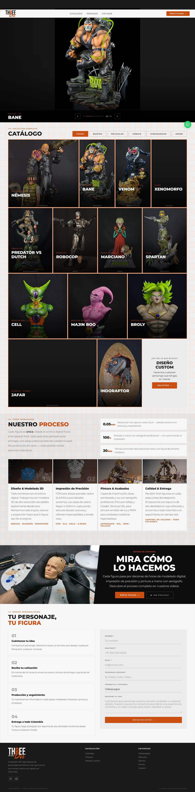

# Threedii Paint Studio — Case Study

> **Studio for hand-painted, 3D-printed collectible figures** · e-commerce storefront + lead funnel.
> 🌐 Live: **https://threedii-paint-studio.vercel.app** · 📍 Colombia

| | |
|---|---|
| **Role** | Solo front-end developer (freelance) |
| **Client** | Threedii — hand-painted, 3D-printed collectible figures |
| **Stack** | React 19 · Vite 8 · React Router · Playwright · Lighthouse CI · Vercel |
| **Status** | Live in production |

---

## The client
Threedii is a Colombian studio that **designs, 3D-prints and hand-paints high-detail collectible figures** of characters from films, comics, video games and anime. Each piece is made to order in SLA resin or FDM + resin, airbrushed in multiple layers, **18–50 cm tall**, with ~3–6 week lead times — some with removable, interchangeable parts. The site is their storefront and lead funnel.

## What the site does
A fast single-page storefront built to turn browsing into orders.

- **Hero** — bold brand intro and positioning.
- **Catalog** — a **bento-grid gallery** of the line-up, filterable by category: **Bustos · Películas · Cómics · Videojuegos · Anime**. Figures include **Némesis** (Resident Evil), **Venom**, **Xenomorph** (Alien), **Predator vs Dutch**, **RoboCop**, **Spartan** (Halo), **Indoraptor** (Jurassic World), **Jafar** (Aladdin), and **Broly / Cell / Majin Boo** (Dragon Ball).
- **Figure detail** — each opens a view with its universe, description, specs (material, finish, height, lead time) and, where available, an Instagram clip of the real piece.
- **Quote flow ("Cotizar")** — picking a figure prefills a request and opens a **pre-written WhatsApp message**, converting interest straight into a conversation.
- **Process / behind-the-scenes** — how the figures are made.

## Screenshot

## Engineering highlights
- **Performance-first SPA** — build-time responsive images (`sharp`, 400/800/1200w `srcset`), scroll-reveal animations and a desktop custom cursor; Lighthouse budgets enforced in CI.
- **Lead generation** — the figure → WhatsApp quote flow.
- **SEO** — structured data, Open Graph / Twitter cards, an auto-generated sitemap and a `<noscript>` fallback.
- **Quality** — security headers and a Playwright + Lighthouse CI pipeline gating every change.

---

Code is proprietary to Threedii; this repository documents my work for portfolio purposes. Built by <a href="https://github.com/johnvergel-dev">John Vergel</a>.